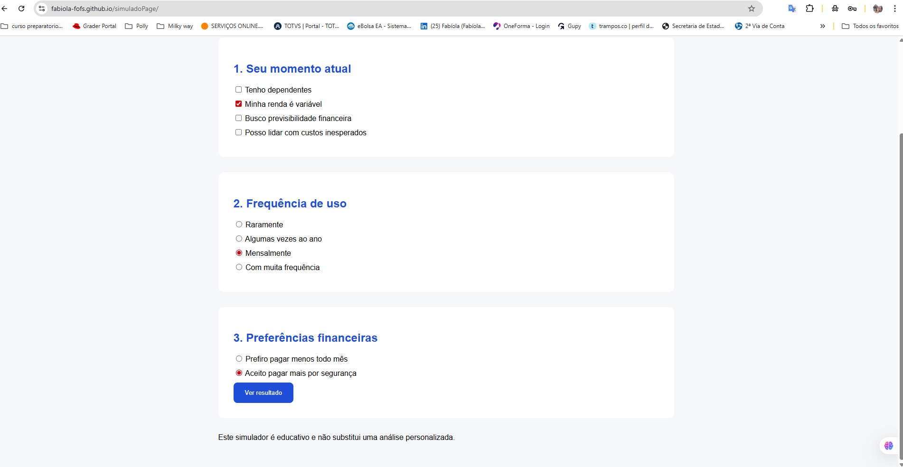

# 💡 Ideia de Captação de Leads

Este fluxo de captação foi pensado para simular um cenário real de marketing digital aplicado ao setor de **planos de saúde**, com foco em conversão, segmentação e automação.

---

## 1️⃣ Página Web (Entrada do Fluxo)

Página criada em **WordPress**, utilizando **Elementor**, com estrutura totalmente orientada à conversão.  
O objetivo principal é conduzir o visitante a interagir com o **formulário do RD Station**, responsável por captar o e-mail e iniciar o fluxo de automação.

- Layout focado em CTA
- Conteúdo objetivo
- Redução de distrações para aumentar a taxa de conversão

---

## 2️⃣ Confirmação de E-mail (RD Station)

Após o preenchimento do formulário, o lead recebe automaticamente um **e-mail de confirmação**, garantindo a validade do contato e alinhamento às boas práticas de comunicação.

Neste mesmo e-mail, o usuário já tem acesso ao **simulado**, dando continuidade à jornada.

---

## 3️⃣ Landing Page de Segmentação

Com o e-mail confirmado, o visitante é direcionado para uma **landing page de segmentação**, onde escolhe o tipo de plano que mais lhe interessa.

Essa etapa é fundamental para:
- Classificação do lead
- Personalização de campanhas futuras
- Melhoria da comunicação e relevância

A segmentação é realizada por meio de um **formulário RD Station**.

---

## 4️⃣ Landing Page do Simulado

Após a segmentação, o redirecionamento para a **landing page do simulado** ocorre de forma automática.

Nessa etapa:
- O usuário realiza o simulado
- Dados comportamentais e preferências são coletados
- O lead é enriquecido no RD Station

---

## 🔁 Continuidade do Fluxo (Próximos Passos)

Após a conclusão do simulado, o lead é **segmentado com base nas informações coletadas**.  
A proposta para evolução do projeto é a implementação de uma **campanha de nutrição personalizada**, considerando:

- Tipo de plano selecionado
- Perfil do lead
- Estágio na jornada de decisão

Essa abordagem permite comunicações mais relevantes e aumenta as chances de conversão em etapas futuras.

---
