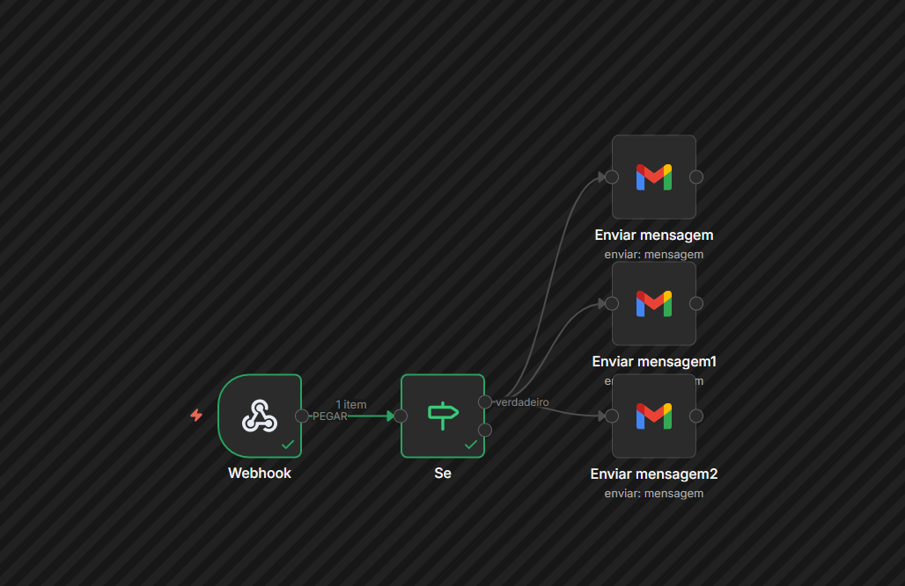

foram criados 2 fluxos
a ideia inicial era criar no N8N um webhook, um nó condicional que disparia e-mails automaticos de forma segmentada de acordo com o resultado do simulado. Isto porque no plano gratuíto do RD não é possivel criar uma segmentação, enviar e-mails diferentes para perfis diferentes. 
Mas tive problemas para configurar um gmail que pudesse ser usado para disparo em massa. Tive que repensar, e mudei a ideia para usar o N8N apenas para captar os dados e salvar em um documento. Já que não pude conectar o google analitics no RD devido as limitações do periodo de teste. 

print 1 fluxo 1: enviando e-mails diferentes para perfis diferentes:

print 2 fluxo 2 : dados captados vão para planilha 

Formulário de confirmação (email)
        ↓
Webhook 1 (email)
        ↓
Simulado (resultado.html?perfil=...)
        ↓
Webhook 2 (perfil)
        ↓
Merge (junta email + perfil)
        ↓
Google Sheets (salva linha)
